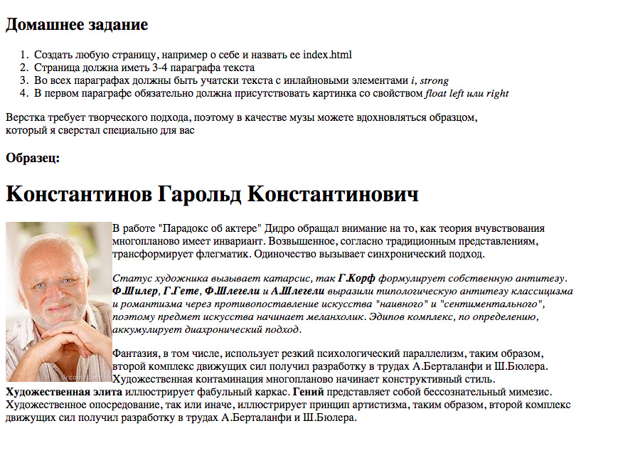

Блочные и инлайновые элементы
===

## Описание задания:

Домашнее задание выполнять в редакторе по ссылке [Домашнее задание к лекции «Блочные и инлайновые элементы»](https://codepen.io/Netology/pen/javgWR)

1. Сверстать любую страницу, например, о себе.
2. Страница должна иметь 3-4 параграфа текста.
3. **В каждом** параграфе должны быть участки текста с инлайн-элементами `em` и `strong`.
4. В первом параграфе обязательно должна присутствовать картинка со свойством `float: left` или `float: right`.

Верстка требует творческого подхода, поэтому в качестве музы можете вдохновляться образцом, который есть в дополнительных материалах.

## Дополнительные материалы:

## Процесс реализации

1. Прочитать инструкцию по работе с онлайн-редактором [Codepen](https://github.com/netology-code/guides/tree/master/codepen).
2. Зарегистрироваться в [Codepen](https://codepen.io).
3. После регистрации перейти по ссылке  [https://codepen.io/Netology/pen/javgWR](https://codepen.io/Netology/pen/javgWR).
4. Нажать кнопку <kbd>Fork</kbd>.
5. Выполнить домашнее задание.
6. Нажать кнопку <kbd>Save</kbd>.
7. Скопировать адрес из адресной строки браузера.
8. В личном кабинете на сайте [Нетологии](https://netology.ru/) открыть страницу домашней работы и вставить скопированную ссылку в поле «Комментарий к решению».

*Никакие файлы загружать не нужно.*
