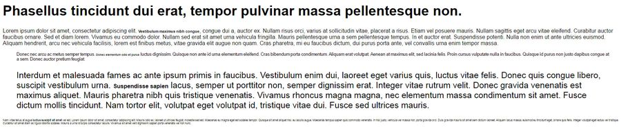
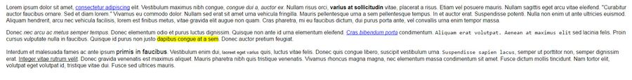
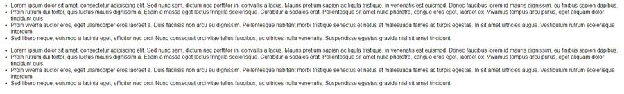

Стили текста и оформления
===

## Описание задания:

Домашнее задание выполнять в редакторе по ссылке [Домашнее задание к лекции «Стили текста и оформления»](https://codepen.io/Netology/pen/pdOqjX)

№1. В следующем тексте установить размер шрифта в `em` или процентах для элементов `strong` так, чтобы в результате размер шрифта в **каждом** элементе `strong` составлял `20px`.

№2. Не меняя разметку, сделать так, чтобы текст был полностью однородным, т.е. стили всех тегов были одинаковыми.

№3. Изменить стиль рамки блока на точечную и установить на фон картинку, которая будет располагаться справа по центру. Также фон блока должен быть светло-серым.

№4. Добавить обводку толщиной `3` пикселя любого цвета для блока таким образом, чтобы *видимое* расстояние между рамкой и обводкой составляло `5px`. Обводка должна быть внутри рамки. На фон установить картинку таким образом, чтобы она покрыла весь блок без повторов.

№5. Сделать маркированный список нумерованным двумя способами. Цифры в первом случае должны быть римскими, во втором — арабскими со скобочкой в конце: 1), 2), 3) и т.д.

№6. Сделать нумерованный список маркированным двумя способами. В качестве маркера в первом способе должен выступать квадратик, во втором – символ звездочки `*`.

## Требования к заданию:

- Все задачи должны быть выполнены только с помощью CSS.
- **Нельзя изменять HTML-разметку**.

## Процесс реализации

1. Прочитать инструкцию по работе с онлайн-редактором [Codepen](https://github.com/netology-code/guides/tree/master/codepen).
2. Зарегистрироваться в [Codepen](https://codepen.io).
3. После регистрации перейти по ссылке [https://codepen.io/Netology/pen/pdOqjX](https://codepen.io/Netology/pen/pdOqjX).
4. Нажать кнопку <kbd>Fork</kbd>.
5. Выполнить домашнее задание.
6. Нажать кнопку <kbd>Save</kbd>.
7. Скопировать адрес из адресной строки браузера.
8. В личном кабинете на сайте [Нетологии](https://netology.ru/) открыть страницу домашней работы и вставить скопированную ссылку в поле «Комментарий к решению».

*Никакие файлы загружать не нужно.*
