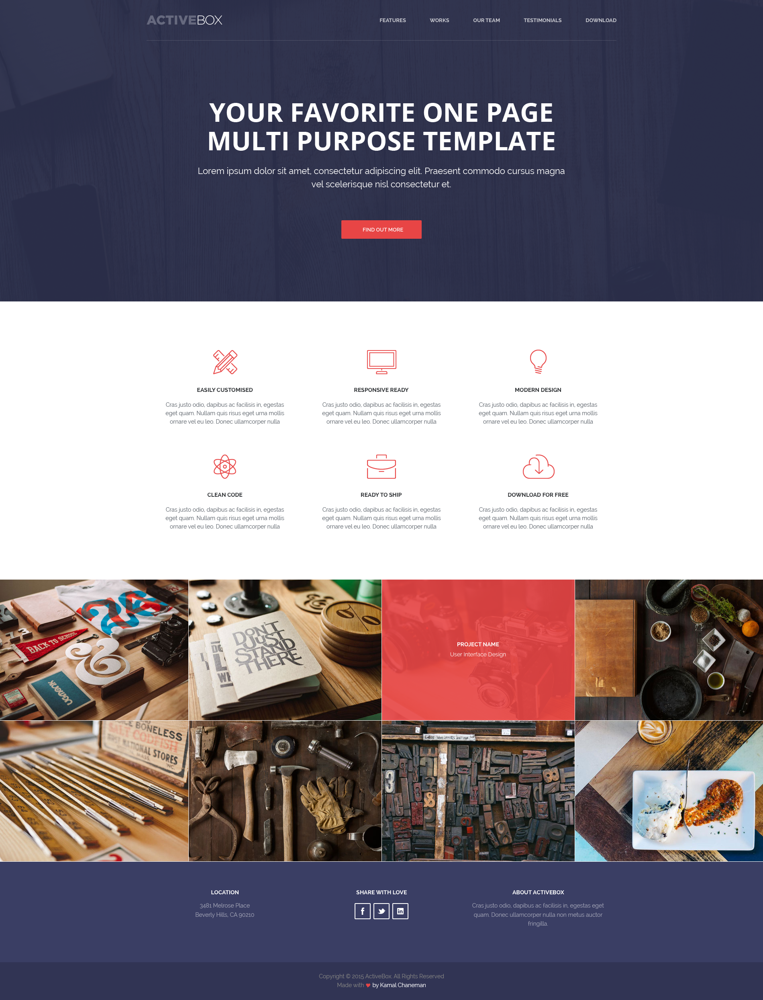

Работа с Adobe Photoshop, вёрстка в точном соответствии с макетом
===

## Описание задания:

Сверстать блок с белым фоном и с красными иконками и блок с фотографиями, 1 к 1 как в макете, который есть в дополнительных материалах.

## Дополнительные материалы:

[Макет домашнего задания](resourses/Homework.psd)

## Загрузка изображений:

При выполнении данной домашней работы вам потребуется разместить в сети изображения, с которыми вы работаете. Вы можете использовать для этого любой хостинг, который предоставляет прямые ссылки на изображения. Также вы можете воспользоваться одним из этих хостингов:

- [cubeupload.com](https://cubeupload.com/)
- [lensdump.com](https://lensdump.com/)

## Процесс реализации

1. Прочитать инструкцию по работе с онлайн-редактором [Codepen](https://github.com/netology-code/guides/tree/master/codepen).
2. Зарегистрироваться в [Codepen](https://codepen.io).
3. После регистрации перейти по ссылке [https://codepen.io/Netology/pen/LexVLr](https://codepen.io/Netology/pen/LexVLr).
4. Нажать кнопку <kbd>Fork</kbd>.
5. Выполнить домашнее задание.
6. Нажать кнопку <kbd>Save</kbd>.
7. Скопировать адрес из адресной строки браузера.
8. В личном кабинете на сайте [Нетологии](https://netology.ru/) открыть страницу домашней работы и вставить скопированную ссылку в поле «Комментарий к решению».

*Никакие файлы загружать не нужно.*