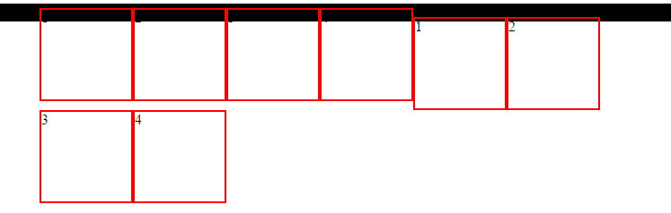
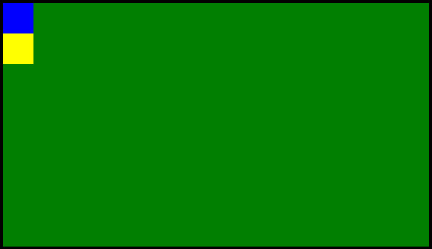
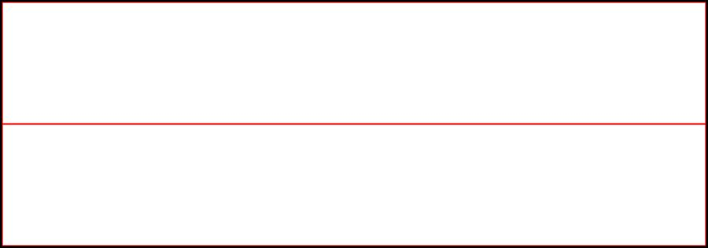

Позиционирование блоков
===

## Описание задания:

Домашнее задание выполнять в редакторе по ссылке [Домашнее задание к лекции «Позиционирование блоков»](https://codepen.io/Netology/pen/gXQLjV)

1. Есть два контейнера, в которых элементам задано свойство `float`. Из-за этого происходит выпадение этих элементов из родителя. Вы должны решить эту проблему. Для первого контейнера необходимо использовать `clearfix` (любая его вариация), для второго – любое другое решение.

2. Есть родительский блок и два дочерних. Задача: синий блок расположить в правом верхнем углу зеленого блока. Желтый блок разместить в правом нижнем углу так, чтобы желтый элемент выходил за пределы зеленого блока на 30 пикселей по горизонтали и 30 по вертикали. И наконец, сместить зеленый блок вправо на 40 пикселей.

## Дополнительное задание

Есть два блока внутри родителя. Задача: используя свойство `float`, сделать так, чтобы первый дочерний блок был в ширину 250 пикселей, а другой занимал все оставшееся место вне зависимости от ширины окна (для проверки нужно сжать окно браузера). Попутно решить проблему с вытеканием любым удобным способом.

## Процесс реализации

1. Прочитайте инструкцию по работе с онлайн-редактором [Codepen](https://github.com/netology-code/guides/tree/master/codepen).
2. После регистрации перейдите по ссылке [https://codepen.io/Netology/pen/gXQLjV](https://codepen.io/Netology/pen/gXQLjV).
3. Нажмите кнопку <kbd>Fork</kbd>.
4. Выполните домашнее задание.
5. Нажмите кнопку <kbd>Save</kbd>.
6. Скопируйте адрес из адресной строки браузера.
7. В личном кабинете на сайте [Нетологии](https://netology.ru/) откройте страницу домашней работы и вставьте скопированную ссылку в поле «Комментарий к решению».

*Никакие файлы загружать не нужно*
