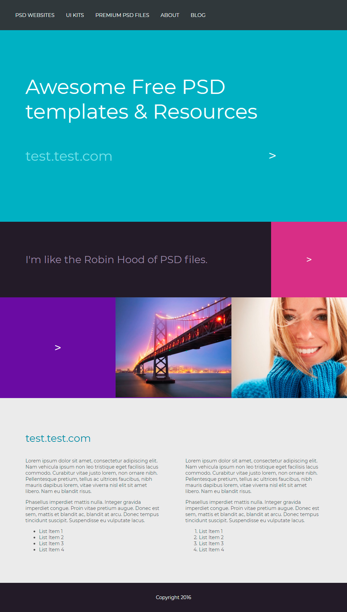

Профессиональное оформление кода
===

## Описание задания:

Домашнее задание выполнять в редакторе по ссылке [Домашнее задание к лекции «Процесс верстки сайта»](https://codepen.io/Netology/pen/OzXdJV)

Необходимо проверить качество кода работы по ссылке:

1. Найдите и исправьте ошибки в HTML-разметке и CSS-стилях.
2. Проверьте на соответствие правилам именование файлов, укажите на ошибки, если они есть.
3. Исправьте файл в соответствии с правилами оформления кода.

## Результат, который у вас должен получиться:

Свёрстанная страница без ошибок в разметке, именовании и оформлении кода: 

## Процесс реализации

1. Прочитать инструкцию по работе с онлайн-редактором [Codepen](https://github.com/netology-code/guides/tree/master/codepen).
2. Зарегистрироваться в [Codepen](https://codepen.io).
3. После регистрации перейти по ссылке [https://codepen.io/Netology/pen/OzXdJV](https://codepen.io/Netology/pen/OzXdJV).
4. Нажать кнопку <kbd>Fork</kbd>.
5. Выполнить домашнее задание.
6. Нажать кнопку <kbd>Save</kbd>.
7. Скопировать адрес из адресной строки браузера.
8. В личном кабинете на сайте [Нетологии](https://netology.ru/) открыть страницу домашней работы и вставить скопированную ссылку в поле «Комментарий к решению». 

*Никакие файлы загружать не нужно.*
