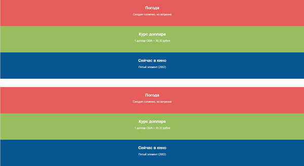
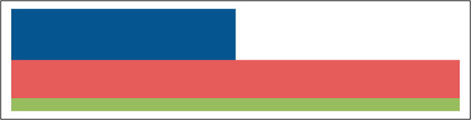

Стили позиционирования, отступы и размеры блоков
===

## Описание задания:

Домашнее задание выполнять в редакторе по ссылке [Домашнее задание к лекции «Стили позиционирования, отступы и размеры блоков»](https://codepen.io/Netology/pen/RjqWdo)

1. На сайте есть три блока друг под другом: погода (красный), курс доллара (зелёный) и афиша кино (синий). Дизайнер решил поменять дизайн сайта. Теперь эти блоки должны быть выстроены в ряд друг за другом: красный, зелёный и синий.

Найти два различных способа сделать это и разместить способы друг под другом.

- Ширина каждого из этих цветных блоков должна составлять 1/3 ширины родителя;
- Каждому из цветных блоков нужно добавить рамку толщиной `10px`;
- Между выстроенными в ряд цветными блоками не должно быть отступов.

2. Не меняя разметку сделать так, чтобы `div.overlay` располагался в правом нижнем углу контейнера вплотную к рамке, поверх всех остальных блоков.

## Требования к заданию:

- Все задачи должны быть выполнены только с помощью CSS;
- **Нельзя изменять HTML-разметку**.

## Процесс реализации

1. Прочитать инструкцию по работе с онлайн-редактором [Codepen](https://github.com/netology-code/guides/tree/master/codepen).
2. Зарегистрироваться в [Codepen](https://codepen.io).
3. После регистрации перейти по ссылке [https://codepen.io/Netology/pen/RjqWdo](https://codepen.io/Netology/pen/RjqWdo) на пен с домашним заданием.
4. Нажать кнопку <kbd>Fork</kbd>.
5. Выполнить домашнее задание.
6. Нажать кнопку <kbd>Save</kbd>.
7. Скопировать адрес из адресной строки браузера.
8. В личном кабинете на сайте [Нетологии](https://netology.ru/) открыть страницу домашней работы и вставить скопированную ссылку в поле «Комментарий к решению».

*Никакие файлы загружать не нужно.*
